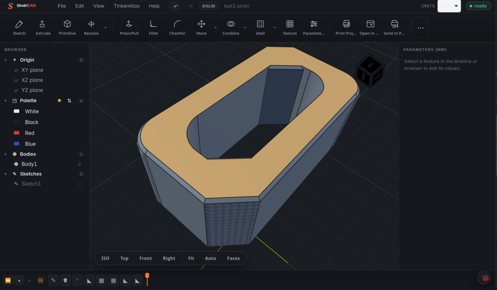
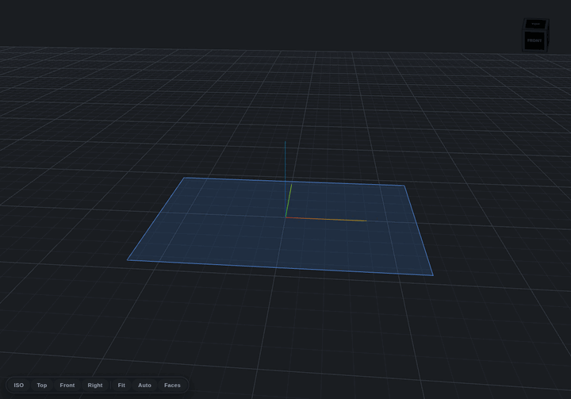
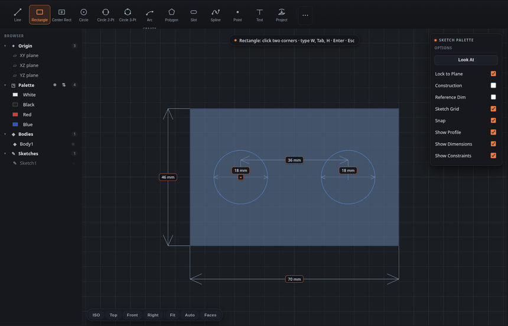
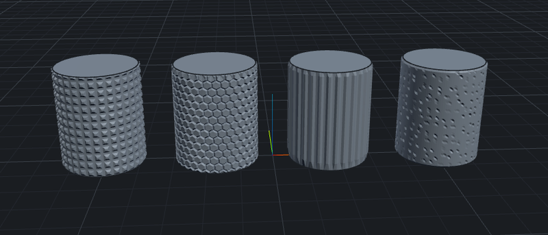
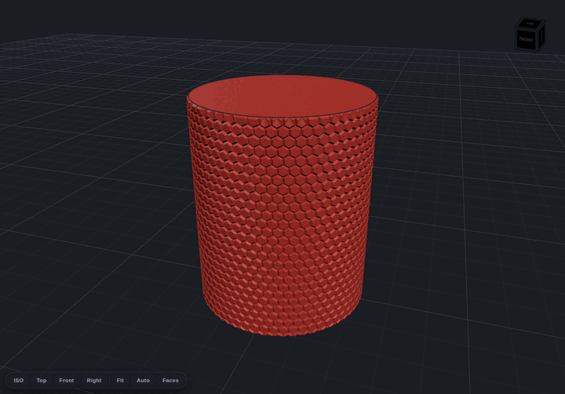
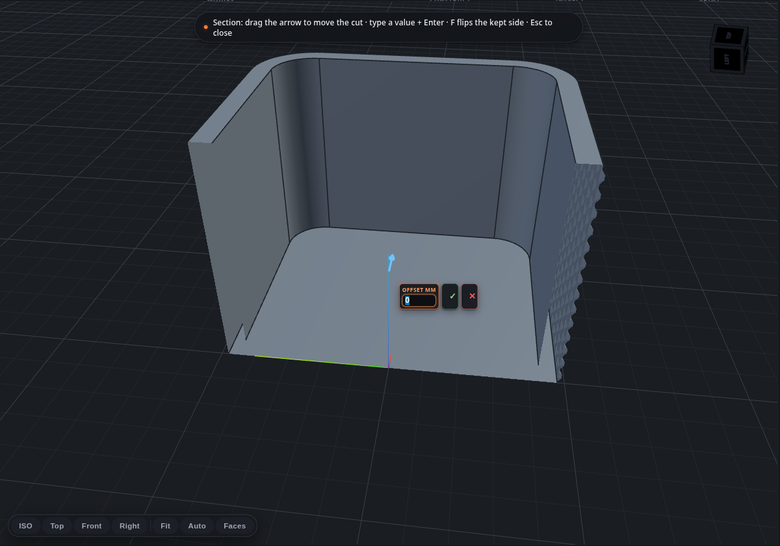
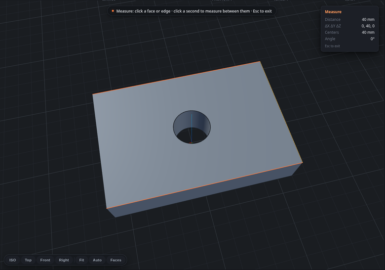
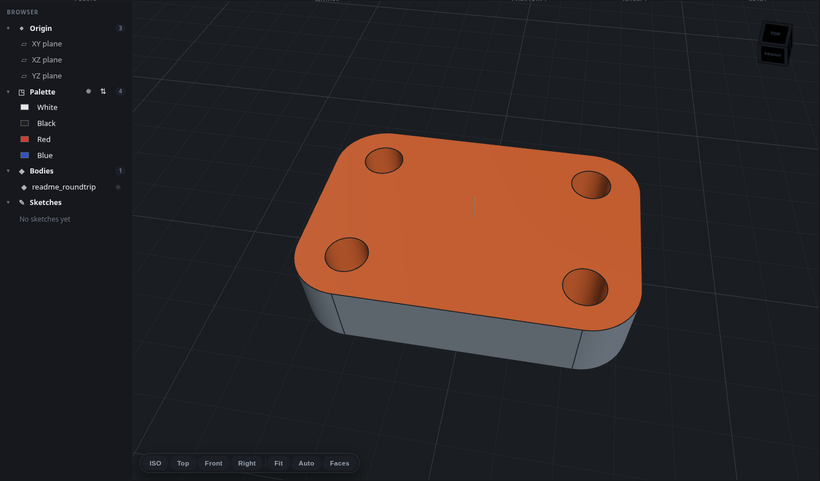
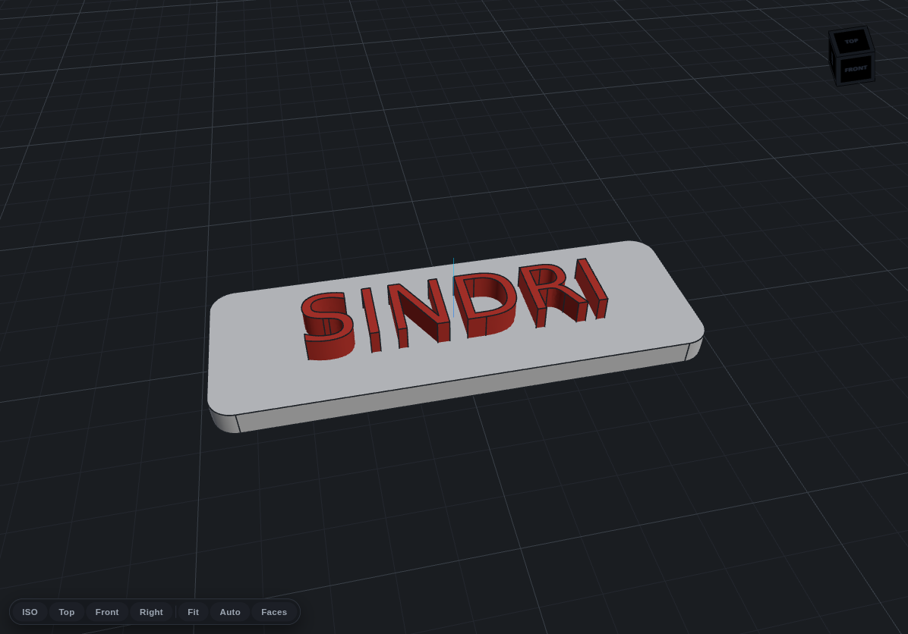
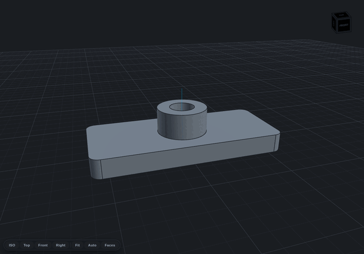

<p align="center">
  <picture>
    <source media="(prefers-color-scheme: dark)" srcset="assets/brand/sindricad-lockup-dark.svg">
    
  </picture>
</p>

Parametric CAD for 3D printing. Runs on Linux, Windows and macOS.

<p align="center">
  <a href="https://github.com/MakerViking/sindricad/releases/tag/beta"></a>
  
  
</p>

SindriCAD is a history-based solid modeler. You sketch, extrude, fillet, and pattern
your way to a part, and every step stays editable in a feature tree. It is not a mesh
editor, and it is not a geometry kernel of its own. It drives
[build123d](https://github.com/gumyr/build123d) on top of OpenCASCADE for the actual
geometry, and puts a real modeling UI and a print workflow on top.

It began on Linux, where good parametric CAD has always been thin on the ground, and
it runs natively on all three desktops now: Linux, Windows and macOS. It is built for
3D printing: color a multi-material model, export it as a ready-to-slice OrcaSlicer
project set up for the Snapmaker U1, and send the sliced G-code to the printer over
the LAN.

> Named for Sindri, the dwarven smith of Norse myth.

<p align="center">
  
</p>

**Status: beta, in ongoing development.** SindriCAD already builds real printed parts,
but the feature set is still filling out and rough edges remain. Expect frequent
releases, report what breaks, and keep backups of documents you care about.

<p align="center">
  <a href="#get-it">Get it</a> ·
  <a href="#what-it-does">What it does</a> ·
  <a href="#sketching">Sketching</a> ·
  <a href="#surface-textures">Textures</a> ·
  <a href="#inspect-and-measure">Measure</a> ·
  <a href="#import-and-round-trip">Import</a> ·
  <a href="#snapmaker-u1-print-pipeline">Print pipeline</a> ·
  <a href="#document-format">Document format</a><br>
  <a href="#install">Install</a> ·
  <a href="#build-and-run">Build and run</a> ·
  <a href="#architecture">Architecture</a> ·
  <a href="#project-layout">Project layout</a> ·
  <a href="#license">License</a> ·
  <a href="#support">Support</a> ·
  <a href="CHANGELOG.md">Changelog</a>
</p>

## Get it

Installers for **Linux, Windows and macOS** are on the
[latest beta release](https://github.com/MakerViking/sindricad/releases/tag/beta),
rebuilt automatically from every green `main` build. Free, no account needed, and
everything is bundled including Python and the geometry engine. The builds are
unsigned, so the first launch needs one extra step per platform:
[see Install](#install) for the exact steps. macOS is the awkward one: it refuses
outright and claims the app is damaged, which it is not.

If SindriCAD looks useful, starring the repo helps other people find it.

What changed in each build is in [CHANGELOG.md](CHANGELOG.md), and the same notes
appear on the release itself.

## What it does

- **Sketching** with lines, arcs, circles, splines, rectangles, slots, polygons, and
  text in system fonts, plus associative patterns (bolt circles, grids, honeycomb) and
  a PlaneGCS constraint solver. Dimensions are entered on the canvas: type a value,
  press Tab to lock it, Enter to commit.
- **Parameters and expressions**: name a value once, use it anywhere a number goes,
  and write arithmetic between parameters. Change one number and the whole part
  follows.
- **Features**: Extrude (new body, join, cut, intersect, per region), Revolve, Loft,
  Sweep, Press/Pull (multi-face, and extrude up to a target surface), Fillet, Chamfer,
  Shell, Draft, Scale, Mirror, and patterns.
- **Offset Face and Thicken**: push selected faces along their own normals with the
  surrounding walls following, or give surface geometry a wall. Thicken is what turns
  a non-watertight mesh import, which arrives as read-only reference geometry, into a
  solid you can actually model with.
- **Surface textures** (see below).
- **Direct editing**: Move with a live ghost preview, Split, Combine, Delete Face with
  automatic healing, and a cleanup pass for messy imported geometry.
- **Import** STEP, BREP, STL, 3MF, OBJ, and GLB, with facet cleanup and STEP
  canonicalization, so imported parts come back as editable faces instead of a
  triangle soup. A STEP assembly keeps its tree: subassemblies and part names as
  the CAD system wrote them, each part still individually selectable. Export
  STEP, STL, 3MF, and GLB.
- **References that survive edits**: geometry is picked by queryable descriptors (an
  axis, a face normal, the nearest point), never by a topology index. Change an
  upstream parameter and a downstream fillet still lands on the right edge.
- **Measure and section tools** for checking a part before it prints.
- **A print pipeline** for the Snapmaker U1 (see below).

Press `?` in the app for the full keyboard shortcut list.

<p align="center">
  <br>
  <em>A part is its history: sketch, extrude, fillet, cut, texture, and every step stays editable.</em>
</p>

## Sketching

<p align="center">
  
</p>

Sketches are constraint-driven. Dimensions are entered on the canvas: type a value,
Tab to lock it, Enter to commit. A PlaneGCS solver keeps the rest of the profile
consistent as you edit. Equal, parallel, perpendicular, concentric and the usual family
of constraints render as glyphs you can click, and a reference dimension measures
without driving. Conflicting and over-defined constraints are called out rather than
silently ignored.

## Surface textures

<p align="center">
  
</p>

Textures turn a plain face into a tactile printed surface: knurling for grip, hexagon,
rib or wave relief for looks, Voronoi and noise for organic breakup, or any grayscale
image as a height map. Pick faces (or a whole body), set depth, scale, and angle, and
the pattern is applied as real displaced geometry, not a shader trick: what you see
is what the slicer gets.

The faceted patterns are built as exact lattices. Mesh vertices land on the
pattern's own crease lines, so a knurl prints as crisp diamonds and a hexagon
pattern as flat-topped cells with sharp walls, instead of the rounded mush a
sampled height field gives. Patterns wrap around cylinders and cones: ribs and waves
close on themselves at any angle, and the 2D lattices (knurl, hexagon) close at
multiples of 90 degrees, which is geometry rather than a limitation to fix. Textures
can also cut inward instead of embossing outward, and a two-tone mode prints the
textured faces in a different palette color than the rest of the body.

<p align="center">
  <br>
  <em>Patterns wrap a full turn and meet themselves at the seam.</em>
</p>

## Inspect and measure

<p align="center">
  
</p>

A section plane cuts the model live, so a shelled or hollow part can be checked from the
inside before it prints. Drag the arrow along the axis, or type an exact offset.

<p align="center">
  
</p>

Measure reports the true shortest distance between two faces or edges, not just their
centres, along with the per-axis deltas, the centre-to-centre distance, and the angle
between them.

## Import and round-trip

<p align="center">
  
</p>

STEP, BREP, STL, 3MF, OBJ, and GLB come in; STEP, STL, 3MF, and GLB go out. A STEP import
arrives as real B-rep geometry. The faces above are ordinary selections on a body that
was exported to STEP and read straight back in, so imported parts can be measured,
sectioned, textured, and used as sketch planes instead of arriving as a triangle soup.
Mesh formats are cleaned up on the way in, and STEP is canonicalized so its faces come
back in a form the selectors can address.

A STEP file holding an assembly keeps its structure. The Browser shows the tree the
originating CAD system wrote: subassemblies as collapsible groups, parts named as the
file names them, and one entry per solid so a product like "M3 Nut (x20)" stays a single
named group whose twenty pieces are still individually selectable. Two limits worth
knowing up front: subassembly names come from the file and cannot be renamed in the
Browser, and only STEP carries the tree back out so far, not 3MF or glTF. Part colours are
read from the file and written back into an exported STEP, but not displayed on screen,
because a body's colour here means which filament prints it.

Exporting to STEP preserves what import kept: the hierarchy, the part names, the colours
and the position of every occurrence. Re-importing your own export returns the same parts,
names, colours, positions and face count.

## Snapmaker U1 print pipeline

SindriCAD carries print prep for the Snapmaker U1 multi-material printer from model to
machine, so a colored parametric part reaches a print without a manual export dance.

<p align="center">
  <br>
  <em>Sketch text, extruded and mapped to its own filament slot.</em>
</p>

- **Multi-material and multi-color 3MF**: assign palette colors to bodies and export an
  OrcaSlicer project 3MF with per-object extruder (tool) mapping for the U1's tool
  changer (`sidecar/project3mf.py`).
- **Slicer handoff**: "Open in OrcaSlicer" binds the U1 preset with your tuned process
  and filament, so you land ready to slice.
- **Direct device layer**: a Rust Moonraker client (`src-tauri/src/printer.rs`) uploads
  G-code to the printer over the LAN with a filament-mapping dialog, reads the palette
  back from the printer, and monitors the running print.

U1 support will keep growing: I add features as I come up with them and have time
for them.

## Document format

A `.sindri` file is JSON: a parameter table and an ordered list of features.

```jsonc
{
  "parameters": { "width": 40, "height": 20, "thickness": 5 },
  "features": [
    { "id": "f1", "type": "sketch", "plane": "XY",
      "entities": [{ "type": "rectangle", "width": "width", "height": "height" }] },
    { "id": "f2", "type": "extrude", "sketch": "f1", "distance": "thickness", "operation": "new" },
    { "id": "f3", "type": "fillet", "edges": { "kind": "edge", "by": "axis", "axis": "Z" }, "radius": 2 }
  ]
}
```

Any numeric field is either a literal (`5`) or the name of a parameter (`"width"`).

<p align="center">
  <br>
  <em>Change a parameter, the whole part follows, and the corner fillets stay on their edges.</em>
</p>

## Install

The geometry engine and its Python runtime are bundled, so those need no separate
install. On Linux the app uses your distribution's WebKit rather than carrying its own,
which is the one system dependency worth knowing about: see
[Requirements](#requirements). The builds are unsigned for now, so the first launch
needs one extra step per platform. Open the section for your platform:

### Requirements

|  | Needs |
| --- | --- |
| **Linux** (`.deb`, `.rpm`, AppImage) | glibc 2.34 or newer, plus WebKitGTK 4.1, libsoup 3 and GTK 3 from your distribution |
| **Windows** | Windows 10 or 11, x86-64. Edge WebView2, which the setup exe fetches if it is missing |
| **macOS** | Apple Silicon. There is no Intel build yet |

None of the Linux builds carry their own WebKit, the AppImage included. They use the one
your distribution ships, which keeps them smaller and means they follow your distro's
security updates instead of freezing a browser engine in place. The `.deb` and `.rpm`
declare that dependency, so a package install pulls it in for you; an AppImage on a
distribution without WebKitGTK 4.1 installed will need it added by hand.

<details>
<summary><b>NixOS</b> — the AppImage needs its libraries named explicitly</summary>

NixOS is not FHS, so `appimage-run` decides what the AppImage can see, and it exposes
nothing it has not been told about. Adding WebKitGTK and libsoup to it is enough
(confirmed on NixOS 25.05 by the reporter of
[#3](https://github.com/MakerViking/sindricad/issues/3), running 0.1.100):

```nix
programs.appimage = {
  enable = true;
  binfmt = true;
  package = pkgs.appimage-run.override {
    extraPkgs = pkgs: with pkgs; [
      webkitgtk_4_1
      libsoup_3
    ];
  };
};
```

`libsoup_3` matters as much as the WebKit line. On most distributions it arrives as a
dependency of WebKitGTK and nobody has to think about it; here it has to be named.
</details>

Every platform needs working GPU drivers for the 3D viewport (OpenGL or EGL).

WebKit may log `GStreamer element appsink not found`. Nothing in modeling, export or
printing uses it, so it is safe to ignore; installing your distribution's
`gst-plugins-base` silences it.

<details>
<summary><b>Windows</b> (.exe or .msi, self-updating)</summary>

1. Download `SindriCAD_<version>_x64-setup.exe` (or the `.msi`) from the
   [latest beta](https://github.com/MakerViking/sindricad/releases/tag/beta).
2. The build is unsigned, so SmartScreen will warn "Windows protected your PC". Click
   "More info", then "Run anyway".

SindriCAD needs Microsoft Edge WebView2, which Windows 10 and 11 already ship; the
setup exe fetches it automatically if it is missing. Once installed, SindriCAD
updates itself: it checks the beta release at startup and offers a one-click
restart-and-update.

</details>

<details>
<summary><b>Linux</b> (.AppImage, .deb or .rpm)</summary>

Grab the `.AppImage` (`chmod +x`, updates itself in place), or the `.deb` / `.rpm`
(`sudo dpkg -i` / `sudo rpm -i`; updates come from your package manager workflow, not
in-app).

All three use your distribution's WebKitGTK 4.1 rather than carrying one, so a system
that does not already have it needs it installed first. See
[Requirements](#requirements).

</details>

<details>
<summary><b>macOS</b> (.dmg, unsigned: one command on first launch)</summary>

SindriCAD is not signed with an Apple Developer certificate yet, so macOS
quarantines it on download. It reports that as **"SindriCAD.app is damaged and
can't be opened. You should move it to the Trash."** The download is not damaged.
That is the message macOS shows for an app whose signature it cannot verify.

Drag the app to Applications, then clear the quarantine flag:

```sh
xattr -dr com.apple.quarantine /Applications/SindriCAD.app
```

Adjust the path if you put it somewhere else. Alternatively, open System Settings,
go to Privacy and Security, and choose **Open Anyway** after the first failed
launch.

Right-clicking the app and choosing Open is the older advice and is not enough on
current macOS, which is what this section used to say. Apple code signing is
planned; it needs a paid Apple Developer account.

Builds are **Apple Silicon** only for now. An Intel Mac will fail for a different
reason, and the command above will not help it.

</details>

<details>
<summary><b>3Dconnexion SpaceMouse</b> (optional, one udev rule on Linux)</summary>

SindriCAD reads a SpaceMouse natively for 6DOF camera navigation, with the two
buttons mapped to Fit and Home/ISO. Plug it in: no driver or configuration
needed. Sensitivity and axis inversion live in Settings.

On **Linux** the device node (`/dev/hidrawN`) is root-only until a udev rule
grants the logged-in user access. The `.deb` and `.rpm` packages install that
rule for you and reload udev, so a packaged install just works.

The **AppImage cannot** install system files, so it needs the rule once, by hand:

```sh
sudo curl -fsSL https://raw.githubusercontent.com/MakerViking/sindricad/main/packaging/99-spacemouse.rules -o /usr/lib/udev/rules.d/99-sindricad-spacemouse.rules
sudo udevadm control --reload && sudo udevadm trigger --subsystem-match=hidraw
```

Building from a clone? Run `sudo sh packaging/setup-spacemouse.sh` instead. It
installs the same rule and applies it to an already-connected device.

If SindriCAD can see the device but can't open it, it says so in a notification
rather than failing silently. Two usual causes: the rule above is missing, or
`spacenavd` / the official 3Dconnexion driver is already holding the device.
Stop that service to let SindriCAD read it directly.

</details>

## Build and run

Prerequisites: Node, a Rust toolchain, Python 3.12, [uv](https://docs.astral.sh/uv/),
and WebKitGTK. See [docs/PACKAGING.md](docs/PACKAGING.md) for per-OS package names and
known-good versions. A system OpenCASCADE install is **not** needed for the default
build: the geometry sidecar ships its own OCCT inside its Python wheels. OCCT is only
needed for the opt-in `rust-geom` Cargo feature (see
[docs/PACKAGING.md](docs/PACKAGING.md)).

```bash
# 1. geometry sidecar (Python 3.12 via uv, locked versions from uv.lock)
cd sidecar
uv sync
uv run python test_smoke.py    # backend sanity (rebuild/export/error naming)
uv run python test_ws.py       # WebSocket transport sanity

# 2. the app, from the repo root. Tauri starts Vite and the sidecar for you.
npm install
npm run tauri dev
```

For frontend-only iteration you can run the two halves separately:

```bash
cd sidecar && uv run python server.py     # ws://127.0.0.1:8765
npm run dev                               # http://localhost:5173
```

> Note: on Linux a standalone `python server.py` arms PR_SET_PDEATHSIG and dies with
> the shell that started it. To keep one alive across shells (or on other platforms),
> run it in a terminal you keep open, and kill it by hand when done or it will hold
> port 8765.

## Architecture

```
┌─ Tauri shell (Rust) ──────────────────────────────────────┐
│  • native window, file dialogs                             │
│  • spawns and supervises the Python geometry sidecar       │
│  • kills the sidecar on app exit (process-group + PDEATHSIG)│
│                                                            │
│  ┌─ Frontend (TypeScript, in the webview) ──────────────┐  │
│  │  • Three.js viewport (orbit/pan/zoom, ViewCube,      │  │
│  │    picking, Z-up)                                    │  │
│  │  • UI: browser tree, timeline, parameters, toolbar   │  │
│  │  • owns the DOCUMENT (feature tree + parameters)     │  │
│  └──────────────────┬───────────────────────────────────┘  │
└─────────────────────┼──────────────────────────────────────┘
                      │  JSON over localhost WebSocket (ws://127.0.0.1:8765)
                      ▼
┌─ Geometry sidecar (Python + build123d + OCCT) ────────────┐
│  • rebuild(document) -> mesh + per-triangle faceIds + edges │
│  • export(document, format, path) -> STEP / STL / 3MF       │
│  • selector resolution (topological-naming mitigation)     │
└────────────────────────────────────────────────────────────┘
```

Design decisions worth knowing up front:

- **Geometry lives only in Python** on the shipping path. Rust never touches it there.
  There is an experimental opt-in Rust geometry path on OpenCASCADE, gated behind
  `VITE_GEOM=rust`, but a 2026 feasibility study found a Rust kernel could not beat
  OCCT on robustness or speed, so the Python build123d sidecar stays the default and
  the source of truth.
- **Full rebuild on every change.** The frontend sends the whole document, the sidecar
  rebuilds from scratch and returns a fresh mesh. There is no server-side state.
- **The parametric engine is the build123d tree, re-run.** Nothing more exotic.
- **Selectors, not indices.** Geometry is referenced by queryable descriptors so
  references survive edits that renumber the underlying topology.

See [docs/ARCHITECTURE.md](docs/ARCHITECTURE.md) for the full invariant list and the
rebuild pipeline, and [docs/PROTOCOL.md](docs/PROTOCOL.md) for the sidecar's wire
protocol.

## Project layout

```
sidecar/      build123d geometry service (builder, geom_select, tessellate, exporters, server)
src/          frontend: viewport/, ui/, document/, geometry/, input/, io/, print/
src-tauri/    Rust shell: lib.rs (entry), sidecar.rs (lifecycle), printer.rs (U1 device layer)
```

## License

SindriCAD is licensed under the GNU Affero General Public License v3.0
(`AGPL-3.0-only`), see [LICENSE](LICENSE). AGPL's network copyleft means any fork, or
any modified version offered over a network, has to publish its source under the same
terms.

Contributions are welcome under [CONTRIBUTING.md](CONTRIBUTING.md), which includes a
short contributor agreement so the project can stay open under the AGPL while the
maintainer can also offer commercial terms to those who need them. Third-party
components and their licenses are listed in [NOTICE.md](NOTICE.md).

## Support

SindriCAD is free and open source. If it earns a place in your workflow, you can back
development on [Patreon (MuninWorks)](https://www.patreon.com/MuninWorks). Patronage
covers the servers, domains, and tooling behind this and my other projects.
